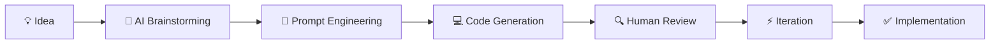

# VibeCoding

  <h3>🤖 AI-Assisted Development Workflows</h3>
  
  

    
    
    
  

This directory explores the fascinating intersection of human creativity and artificial intelligence in software development. "VibeCoding" represents the new paradigm of AI-assisted development where developers work in harmony with AI tools to amplify their capabilities and accelerate innovation.

📖 **Blog Post**: [GenAI Series: My Tryst with AI-Assisted Development](https://www.mlwhiz.com/p/genai-series-my-tryst-with-ai-assisted)

## 🌟 What is VibeCoding?

VibeCoding is more than just using AI tools for coding - it's about establishing a synergistic relationship between human intuition and artificial intelligence. It represents a new way of thinking about software development where:

- **Creativity meets Efficiency**: Human creativity guides AI's computational power
- **Rapid Prototyping**: Ideas transform into working code at unprecedented speed
- **Enhanced Problem Solving**: Complex challenges tackled through human-AI collaboration
- **Continuous Learning**: Developers and AI tools evolve together

## 🛠️ AI-Assisted Development Stack

### Code Generation Tools
- **GitHub Copilot**: Intelligent code completion and suggestions
- **ChatGPT/GPT-4**: Complex problem solving and architecture guidance
- **Claude**: Detailed code analysis and refactoring assistance
- **Codex**: API-driven code generation for specific tasks

### Development Assistants
- **Cursor**: AI-powered code editor with contextual understanding
- **Tabnine**: Advanced autocomplete with team learning
- **Replit Ghostwriter**: Collaborative AI coding companion
- **Amazon CodeWhisperer**: AWS-integrated development assistant

### Specialized Tools
- **DeepCode**: AI-powered code review and bug detection
- **Sourcery**: Automated code quality improvement
- **Kite**: Python-focused intelligent coding assistant
- **IntelliCode**: Visual Studio's AI-enhanced IntelliSense

## 🎯 Core Principles of VibeCoding

### 1. **Human-Centric Design**
- AI augments human capabilities, doesn't replace them
- Developers maintain creative control and decision-making
- Focus on solving real problems, not just generating code

### 2. **Iterative Collaboration**
- Continuous feedback loop between human and AI
- Refine and improve through multiple iterations
- Learn from each interaction to enhance future outcomes

### 3. **Context Awareness**
- Provide rich context to AI tools for better results
- Understand project constraints and requirements
- Maintain awareness of broader system architecture

### 4. **Quality Assurance**
- AI-generated code requires human review and validation
- Implement robust testing and quality control processes
- Balance speed with reliability and maintainability

## 🚀 VibeCoding Workflows

### Ideation to Implementation

### Problem-Solving Process
1. **Define the Challenge**: Clearly articulate the problem
2. **Explore with AI**: Use AI to understand different approaches
3. **Generate Solutions**: Create multiple implementation options
4. **Evaluate and Refine**: Human judgment guides selection and improvement
5. **Implement and Test**: Deploy with comprehensive validation
6. **Learn and Document**: Capture insights for future use

### Code Review and Optimization
- **AI-Assisted Analysis**: Automated code review and suggestions
- **Performance Optimization**: AI-driven performance improvements
- **Security Scanning**: Intelligent vulnerability detection
- **Documentation Generation**: Automated comment and documentation creation

## 🎨 Creative Coding Patterns

### Exploratory Development
- Rapid prototyping with AI assistance
- Quick iteration on multiple approaches
- Creative problem-solving through AI collaboration

### Architecture Design
- AI-powered system design suggestions
- Pattern recognition and recommendation
- Scalability and performance considerations

### Code Refactoring
- Intelligent code restructuring
- Automated optimization suggestions
- Legacy code modernization

### Testing and Validation
- AI-generated test cases
- Automated testing strategies
- Quality assurance automation

## 📊 Productivity Gains

### Time Savings
- **Code Generation**: 40-60% faster initial development
- **Debugging**: AI-assisted error detection and resolution
- **Documentation**: Automated generation of comments and docs
- **Learning**: Accelerated understanding of new technologies

### Quality Improvements
- **Consistency**: Standardized coding patterns across projects
- **Best Practices**: AI enforces coding standards and conventions
- **Error Reduction**: Proactive bug detection and prevention
- **Performance**: Optimized algorithms and data structures

### Innovation Acceleration
- **Rapid Experimentation**: Quick testing of multiple approaches
- **Technology Adoption**: Faster learning of new frameworks and tools
- **Creative Solutions**: Novel approaches through AI collaboration
- **Knowledge Transfer**: AI democratizes expert-level techniques

## 🧠 Cognitive Partnership

### Human Strengths
- **Creative Problem Solving**: Novel approach design
- **Strategic Thinking**: Long-term architecture decisions
- **User Empathy**: Understanding real-world requirements
- **Quality Judgment**: Evaluating solutions for appropriateness

### AI Strengths
- **Pattern Recognition**: Identifying optimal code patterns
- **Rapid Generation**: Quick creation of boilerplate and structure
- **Comprehensive Knowledge**: Access to vast programming knowledge
- **Consistent Execution**: Reliable implementation of defined patterns

### Synergistic Benefits
- **Enhanced Creativity**: AI inspiration fuels human innovation
- **Accelerated Learning**: Rapid skill development through AI mentorship
- **Reduced Cognitive Load**: AI handles routine tasks, humans focus on strategy
- **Improved Quality**: Combined human judgment and AI consistency

## 🛡️ Best Practices and Guidelines

### Effective Prompting
- **Be Specific**: Clear, detailed requirements yield better results
- **Provide Context**: Share relevant project information and constraints
- **Iterate Gradually**: Build complexity through incremental improvements
- **Validate Outputs**: Always review and test AI-generated code

### Code Quality Management
- **Human Review**: Never deploy AI code without thorough review
- **Testing Integration**: Comprehensive testing of all AI-generated components
- **Security Validation**: Special attention to security implications
- **Performance Monitoring**: Track and optimize AI-assisted code performance

### Skill Development
- **Continuous Learning**: Stay updated with AI tool capabilities
- **Prompt Engineering**: Develop skills in communicating with AI
- **Critical Evaluation**: Maintain ability to assess AI suggestions
- **Tool Mastery**: Deep understanding of AI development tools

## ⚠️ Challenges and Considerations

### Technical Challenges
- **Code Quality Variability**: Inconsistent output quality from AI tools
- **Context Limitations**: AI may miss important project context
- **Integration Complexity**: Merging AI-generated code with existing systems
- **Debugging Difficulty**: Challenges in debugging AI-generated code

### Ethical and Professional Considerations
- **Intellectual Property**: Understanding ownership of AI-generated code
- **Attribution**: Proper crediting of AI assistance in development
- **Skill Atrophy**: Maintaining core programming skills despite AI assistance
- **Over-Dependence**: Avoiding excessive reliance on AI tools

### Mitigation Strategies
- **Balanced Approach**: Use AI as an assistant, not a replacement
- **Continuous Education**: Maintain and develop core programming skills
- **Quality Standards**: Establish rigorous review processes
- **Team Guidelines**: Create clear policies for AI tool usage

## 🔮 Future of VibeCoding

### Emerging Trends
- **Multimodal Development**: Integration of code, design, and documentation
- **Personalized AI Assistants**: AI tools adapted to individual developer preferences
- **Team-Level AI**: AI systems that understand and adapt to team dynamics
- **Domain-Specific AI**: Specialized AI for particular industries or technologies

### Evolution of Tools
- **Better Context Understanding**: AI tools with deeper project comprehension
- **Improved Code Quality**: More reliable and consistent code generation
- **Enhanced Collaboration**: Better integration between human and AI workflows
- **Intelligent Debugging**: AI-powered debugging and optimization tools

## 📚 Learning Resources

### Getting Started
1. **Choose Your Tools**: Select AI development assistants that fit your workflow
2. **Practice Prompting**: Develop skills in communicating with AI effectively
3. **Start Small**: Begin with simple tasks and gradually increase complexity
4. **Learn from Community**: Engage with other developers using AI tools

### Advanced Techniques
- **Custom Training**: Fine-tune AI models for specific domains
- **Workflow Optimization**: Develop efficient human-AI collaboration patterns
- **Tool Integration**: Combine multiple AI tools for enhanced capabilities
- **Quality Frameworks**: Establish robust validation and testing processes

## 🔗 Related Resources

- **Blog Post**: [My Tryst with AI-Assisted Development](https://www.mlwhiz.com/p/genai-series-my-tryst-with-ai-assisted)
- **MLWhiz Series**: [Complete GenAI Series](https://www.mlwhiz.com/)
- **Developer Communities**: AI-assisted development forums and groups
- **Tool Documentation**: Official guides for AI development tools

## 🚀 Call to Action

Embrace the VibeCoding revolution! Start your journey of AI-assisted development by:

1. **Experimenting** with AI coding tools in your daily workflow
2. **Sharing** your experiences and learnings with the community
3. **Contributing** to the evolution of human-AI collaboration in development
4. **Staying Curious** about emerging AI development technologies

The future of software development is collaborative, creative, and AI-enhanced. Join the VibeCoding movement and discover new dimensions of programming productivity and innovation!

---

  

    🚀 <strong>Part of the <a href="https://www.mlwhiz.com/">MLWhiz</a> GenAI Series</strong> 🚀
  

