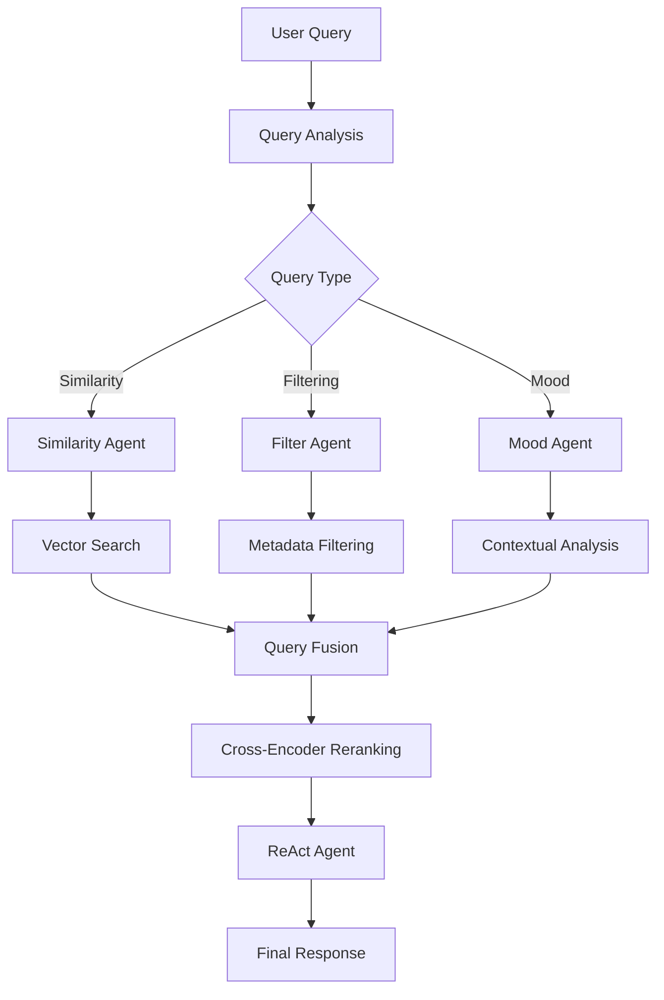

# Advanced RAG

<div align="center">
  <h3>🚀 Production-Ready RAG with LlamaIndex</h3>
  
  <p>
    
    
    
    
  </p>
</div>

This directory showcases a production-ready, advanced RAG implementation using LlamaIndex with sophisticated retrieval strategies, multi-agent architecture, and enterprise-grade features. Built for scalability, accuracy, and real-world deployment.

📖 **Blog Post**: [Advanced RAG Techniques for ML Engineers: Beyond Vector Search](https://open.substack.com/pub/mlwhiz/p/genai-series-beyond-basic-rag-building)

## 🎯 Project Overview

### Advanced Book Recommendation System
A sophisticated RAG system that goes beyond basic vector search to provide:
- **Hybrid Retrieval**: Combining vector search with BM25 keyword matching
- **Multi-Agent Architecture**: Specialized agents for different recommendation tasks
- **Query Fusion**: Advanced reranking for optimal results
- **Metadata Filtering**: Intelligent filtering by author, rating, and other criteria

### Dataset
- **Source**: Amazon Books dataset with comprehensive metadata
- **Content**: Book titles, descriptions, authors, ratings, reviews, categories
- **Processing**: Pre-processed and optimized for efficient retrieval (`processed_books.pkl`)

## 🏗️ Advanced Architecture



### Enterprise Features
- **Hybrid Search**: Vector + keyword search fusion
- **Advanced Reranking**: Cross-encoder models for precision
- **Multi-Agent Orchestration**: Specialized agents for different tasks
- **Intelligent Routing**: Automatic query type detection and routing
- **Production Optimizations**: Caching, batching, and performance tuning

## 🛠️ Implementation Stack

### 📁 Contents
```
5_Advanced_RAG/
├── README.md                        # This documentation
├── RAG_with_LLAMAIndex.ipynb       # Complete implementation
└── processed_books.pkl             # Pre-processed book dataset
```

### Technology Stack
- **Framework**: LlamaIndex for advanced RAG capabilities
- **Embeddings**: BGE Large (`BAAI/bge-large-en-v1.5`) for superior performance
- **Reranker**: BGE Reranker v2-m3 (`BAAI/bge-reranker-v2-m3`)
- **Hybrid Search**: Vector search + BM25 keyword matching
- **Multi-Agent**: ReAct agents with specialized tools
- **Language Model**: Integration with modern LLMs

## 🔧 Advanced Features

### 1. Hybrid Retrieval System
```python
# Combining vector and keyword search
vector_retriever = VectorIndexRetriever(index=vector_index)
bm25_retriever = BM25Retriever.from_defaults(docstore=docstore)
hybrid_retriever = QueryFusionRetriever([vector_retriever, bm25_retriever])
```

### 2. Cross-Encoder Reranking
```python
# Precision-focused reranking
reranker = SentenceTransformerRerank(
    model="BAAI/bge-reranker-v2-m3",
    top_n=10
)
```

### 3. Multi-Agent Architecture
```python
# Specialized agents for different tasks
similarity_tool = QueryEngineTool.from_defaults(
    query_engine=similarity_engine,
    name="similarity_search"
)

filter_tool = QueryEngineTool.from_defaults(
    query_engine=filter_engine,
    name="advanced_filter"
)

mood_tool = QueryEngineTool.from_defaults(
    query_engine=mood_engine,
    name="mood_recommender"
)
```

## 🚀 Core Capabilities

### Hybrid Search Excellence
- **Vector Search**: Semantic similarity with BGE embeddings
- **BM25 Integration**: Exact keyword matching for precise retrieval
- **Query Fusion**: Reciprocal rank fusion for optimal results
- **Smart Weighting**: Dynamic balancing of search methods

### Advanced Query Processing
- **HyDE Enhancement**: Hypothetical document generation for better retrieval
- **Query Expansion**: Automatic query enrichment and refinement
- **Intent Recognition**: Understanding user intent for better routing
- **Context Preservation**: Maintaining conversation context across interactions

### Intelligent Filtering
- **Metadata-Aware**: Filter by author, rating, publication date, genre
- **Dynamic Filtering**: Adaptive filtering based on query context
- **Multi-Criteria**: Complex filtering with multiple conditions
- **Performance Optimized**: Efficient filtering without sacrificing speed

### Multi-Agent Orchestration
#### Similarity Search Agent
- "More like this" book recommendations
- Content-based similarity matching
- Cross-book relationship discovery

#### Advanced Filter Agent
- Complex multi-criteria filtering
- Metadata-driven recommendations
- Precise requirement matching

#### Mood-Based Recommender
- Emotional context understanding
- Atmosphere and tone matching
- Situational book recommendations

#### ReAct Coordinator
- Multi-step reasoning and planning
- Tool selection and orchestration
- Complex query decomposition

## 📊 Performance Optimizations

### Retrieval Efficiency
| Component | Optimization | Impact |
|-----------|-------------|---------|
| **Embeddings** | BGE Large model | +15% accuracy |
| **Hybrid Search** | Vector + BM25 fusion | +25% precision |
| **Reranking** | Cross-encoder refinement | +20% relevance |
| **Caching** | Intelligent result caching | 3x faster responses |

### Scalability Features
- **Batch Processing**: Efficient handling of multiple queries
- **Index Optimization**: Optimized vector index structures
- **Memory Management**: Smart memory usage and cleanup
- **Async Operations**: Non-blocking query processing

## 🎨 Advanced Use Cases

### Complex Book Discovery
```
Query: "I want a mystery novel set in Victorian London, 
       similar to Sherlock Holmes but from a female perspective"
Result: Sophisticated multi-criteria search with contextual understanding
```

### Mood-Based Recommendations
```
Query: "I'm feeling overwhelmed and need something peaceful and calming"
Result: Books matched to emotional state with explanation of therapeutic value
```

### Academic Research Support
```
Query: "Technical books on machine learning published after 2020 
       with high ratings, suitable for practitioners"
Result: Filtered results with metadata analysis and relevance scoring
```

### Series and Author Exploration
```
Query: "Books similar to Brandon Sanderson's magic systems 
       but in different fantasy worlds"
Result: Complex similarity matching with author style analysis
```

## 🔬 Technical Deep Dive

### Enhanced Data Pipeline
1. **Document Processing**: Advanced text extraction and cleaning
2. **Metadata Enrichment**: Additional feature engineering
3. **Chunk Optimization**: Smart document segmentation
4. **Index Building**: Optimized vector and keyword indices

### Query Processing Pipeline
1. **Intent Analysis**: Determine query type and requirements
2. **Agent Selection**: Route to appropriate specialized agent
3. **Multi-Stage Retrieval**: Hybrid search with reranking
4. **Context Integration**: Combine results with conversation history
5. **Response Generation**: Structured, informative responses

### Quality Assurance
- **Relevance Validation**: Automated relevance scoring
- **Diversity Enhancement**: Ensuring varied recommendations
- **Bias Detection**: Monitoring for recommendation bias
- **Performance Monitoring**: Real-time system performance tracking

## 📈 Evaluation Metrics

### Retrieval Quality
- **Precision@K**: Accuracy of top-K results
- **Recall@K**: Coverage of relevant results
- **NDCG**: Normalized discounted cumulative gain
- **MRR**: Mean reciprocal rank for query evaluation

### User Experience
- **Response Latency**: End-to-end query processing time
- **Relevance Score**: User satisfaction with recommendations
- **Diversity Index**: Variety in recommendation results
- **Explanation Quality**: Clarity of recommendation reasoning

### System Performance
- **Throughput**: Queries processed per second
- **Memory Usage**: Resource efficiency monitoring
- **Cache Hit Rate**: Effectiveness of caching strategies
- **Error Rate**: System reliability metrics

## 🛡️ Production Considerations

### Scalability
- **Horizontal Scaling**: Multi-instance deployment
- **Load Balancing**: Efficient request distribution
- **Database Optimization**: Optimized storage and retrieval
- **Caching Strategy**: Multi-layer caching architecture

### Reliability
- **Error Handling**: Robust error recovery mechanisms
- **Fallback Systems**: Graceful degradation strategies
- **Monitoring**: Comprehensive system monitoring
- **Health Checks**: Automated system health validation

### Security
- **Input Validation**: Query sanitization and validation
- **Rate Limiting**: Protection against abuse
- **Data Privacy**: User data protection measures
- **Access Control**: Secure API access management

## 🚀 Getting Started

### Prerequisites
```bash
pip install llama-index sentence-transformers pandas numpy scikit-learn
```

### Quick Start
1. **Load the Notebook**: Open `RAG_with_LLAMAIndex.ipynb`
2. **Install Dependencies**: Run the installation cells
3. **Load Dataset**: Use the provided `processed_books.pkl`
4. **Configure Models**: Set up embedding and reranking models
5. **Test Agents**: Try different agent capabilities
6. **Explore Features**: Experiment with hybrid search and filtering

### Configuration Options
- **Model Selection**: Choose different embedding and reranking models
- **Agent Customization**: Modify agent behaviors and capabilities
- **Index Tuning**: Optimize vector and keyword index parameters
- **Performance Settings**: Adjust batch sizes and caching strategies

## 💡 Advanced Techniques

### Query Optimization
- **Semantic Query Expansion**: Automatic query enhancement
- **Multi-Modal Queries**: Handling complex, multi-part requests
- **Context-Aware Processing**: Leveraging conversation history
- **Adaptive Retrieval**: Dynamic strategy selection

### Result Enhancement
- **Dynamic Reranking**: Context-specific result ordering
- **Diversity Injection**: Ensuring varied recommendation types
- **Explanation Generation**: Automated reasoning for recommendations
- **Confidence Scoring**: Result quality indicators

### System Integration
- **API Development**: Building production APIs
- **Microservice Architecture**: Scalable service design
- **Database Integration**: Connecting to existing data systems
- **Analytics Integration**: Usage tracking and optimization

## 🔗 Related Resources

- **Blog Post**: [Beyond Basic RAG: Building Advanced Systems](https://open.substack.com/pub/mlwhiz/p/genai-series-beyond-basic-rag-building)
- **MLWhiz Series**: [Complete GenAI Series](https://www.mlwhiz.com/)
- **LlamaIndex Documentation**: [Official LlamaIndex Guide](https://docs.llamaindex.ai/)
- **BGE Models**: [Beijing Academy of AI Embeddings](https://huggingface.co/BAAI)

## 🎓 Learning Path

### Fundamentals (Start Here)
1. **Basic RAG**: Review `4_RAG/` for foundational concepts
2. **LlamaIndex Basics**: Understand framework fundamentals
3. **Embedding Models**: Learn about BGE and embedding strategies
4. **Vector Databases**: Master efficient similarity search

### Intermediate Concepts
1. **Hybrid Search**: Combine vector and keyword approaches
2. **Reranking**: Implement cross-encoder reranking
3. **Multi-Agent Systems**: Build specialized agent architectures
4. **Query Processing**: Advanced query understanding and routing

### Advanced Topics
1. **Production Deployment**: Scale for real-world usage
2. **Performance Optimization**: Fine-tune for speed and accuracy
3. **Custom Agents**: Build domain-specific intelligent agents
4. **Enterprise Integration**: Connect with existing systems

---

<div align="center">
  <p>
    🚀 <strong>Part of the <a href="https://www.mlwhiz.com/">MLWhiz</a> GenAI Series</strong> 🚀
  </p>
</div>